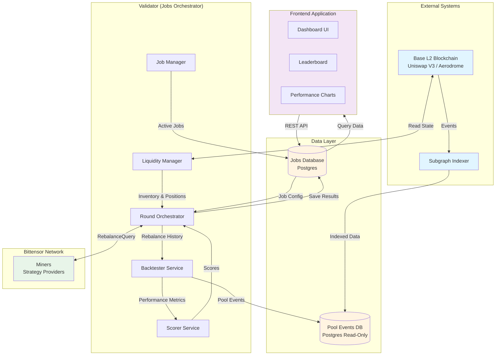
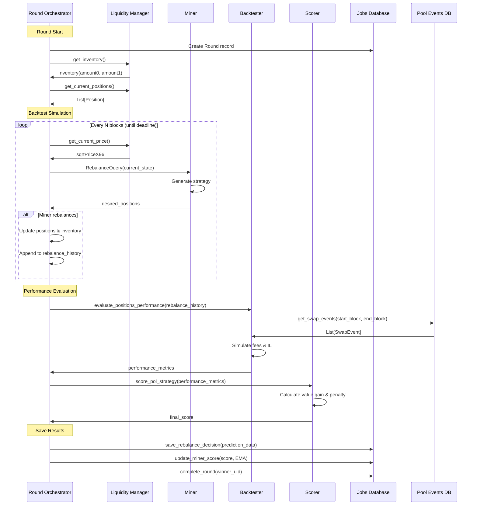
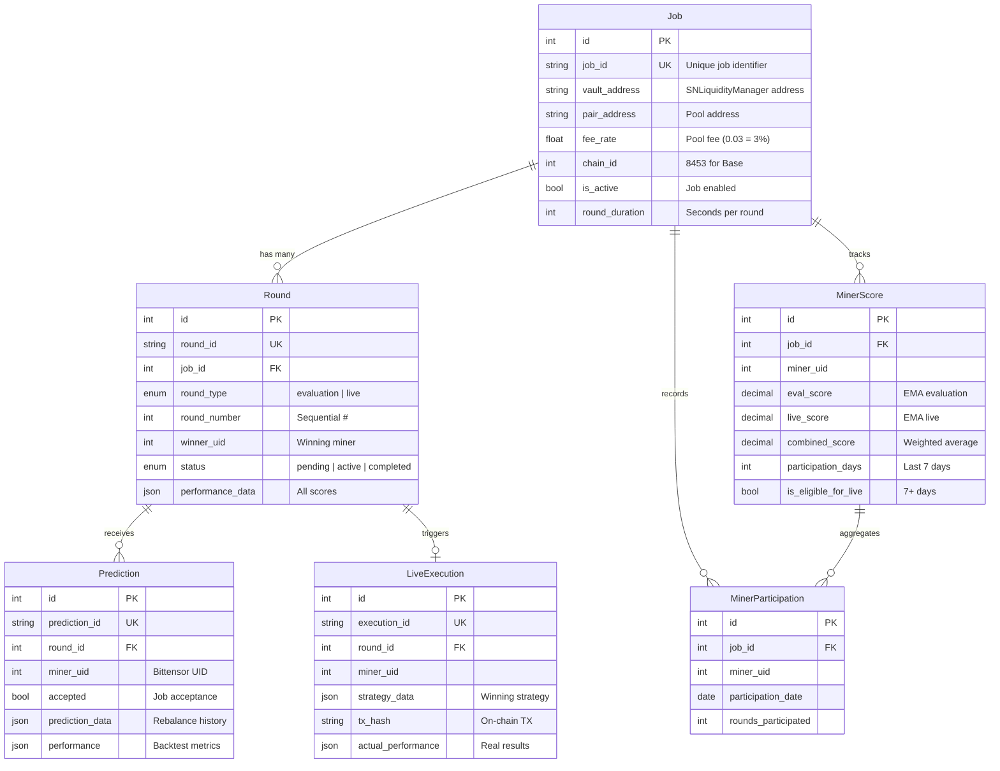
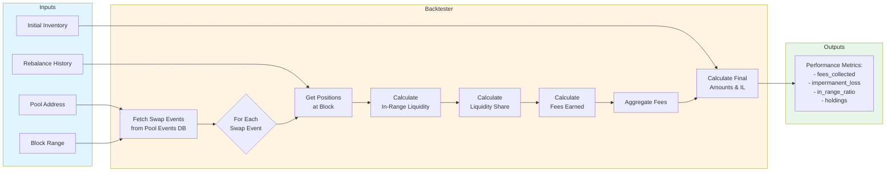
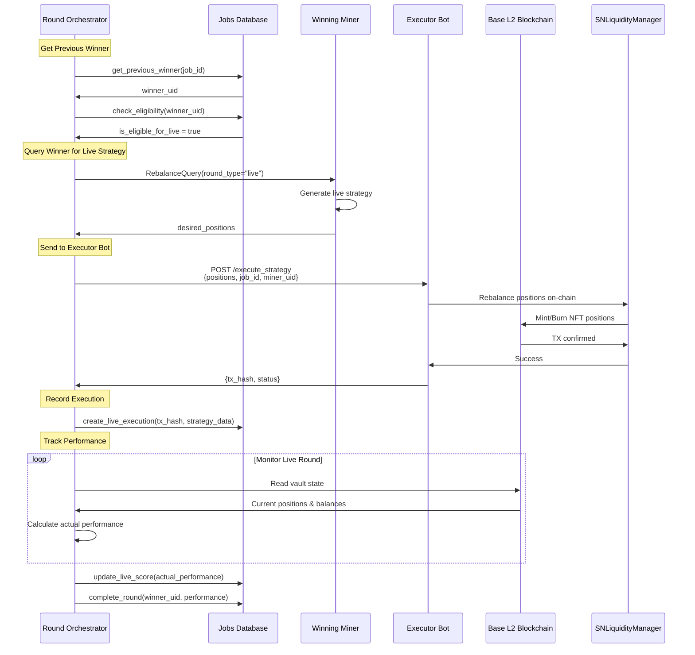
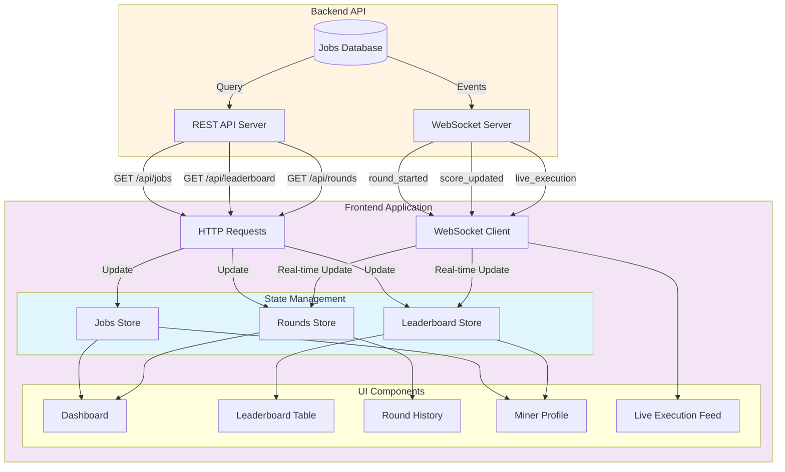

# SN98 ForeverMoney - Data Flow & Architecture Diagrams

> Visual reference for understanding how data flows through the system

---

## Complete System Data Flow



---

## Evaluation Round Data Flow



---

## Data Entity Relationships



---

## Backtester Data Pipeline



**Key Insight**: Backtester uses actual pool liquidity from swap events to calculate precise fee shares, not naive assumptions.

---

## Scorer Algorithm Flow

```mermaid
graph TB
    Start[Performance Metrics<br/>+ Initial Inventory]
    
    CalcValue[Calculate Value Gain<br/>final_value - initial_value]
    
    CalcLoss[Calculate Inventory Loss<br/>loss0 = max(0, init0 - final0)<br/>loss1 = max(0, init1 - final1)]
    
    SmoothMax[Smooth-Max Aggregation<br/>log-sum-exp of loss ratios]
    
    Penalty[Exponential Penalty<br/>exp(-λ × loss_ratio)]
    
    ApplyPenalty{Value Gain<br/>Positive?}
    
    PosScore[score = value_gain × penalty]
    NegScore[score = value_gain / penalty]
    
    FinalScore[Final Score]
    
    Start --> CalcValue
    CalcValue --> CalcLoss
    CalcLoss --> SmoothMax
    SmoothMax --> Penalty
    Penalty --> ApplyPenalty
    ApplyPenalty -->|Yes| PosScore
    ApplyPenalty -->|No| NegScore
    PosScore --> FinalScore
    NegScore --> FinalScore
    
    style Start fill:#e1f5ff
    style FinalScore fill:#e8f5e9
```

**Penalty Examples**:
| Loss % | Penalty Factor | Effect on Score |
|--------|----------------|-----------------|
| 0% | 1.00 | No penalty |
| 5% | 0.61 | -39% |
| 10% | 0.37 | -63% |
| 20% | 0.14 | -86% |
| 50% | 0.007 | -99.3% |

---

## Live Execution Flow



---

## Frontend Data Pipeline



---

## Score Calculation Timeline

```mermaid
gantt
    title Miner Score Evolution (Example Timeline)
    dateFormat X
    axisFormat Day %d
    
    section Evaluation Rounds
    Round 1 (Score: 100)    :0, 1
    Round 2 (Score: 150)    :1, 2
    Round 3 (Score: 120)    :2, 3
    Round 4 (Score: 180)    :3, 4
    
    section Live Rounds
    Not eligible            :0, 7
    First Live (Score: 200) :7, 8
    Live Round 2 (Score: 190):8, 9
    
    section Eligibility
    Participation Days < 7  :crit, 0, 7
    Eligible for Live       :done, 7, 9
```

**Score Evolution Example**:

| Day | Round Type | Round Score | Old Eval | New Eval | Old Live | New Live | Combined |
|-----|------------|-------------|----------|----------|----------|----------|----------|
| 1 | Evaluation | 100 | 0 | **10** | 0 | 0 | **6** |
| 2 | Evaluation | 150 | 10 | **24** | 0 | 0 | **14.4** |
| 3 | Evaluation | 120 | 24 | **33.6** | 0 | 0 | **20.2** |
| 4 | Evaluation | 180 | 33.6 | **48.2** | 0 | 0 | **28.9** |
| ... | ... | ... | ... | ... | ... | ... | ... |
| 8 | Live | 200 | 120 | **120** | 0 | **60** | **96** |
| 9 | Live | 190 | 120 | **120** | 60 | **99** | **111.6** |

**Formulas**:
```python
# Evaluation EMA (α = 0.1)
new_eval = old_eval * 0.9 + round_score * 0.1

# Live EMA (α = 0.3)
new_live = old_live * 0.7 + round_score * 0.3

# Combined
combined = new_eval * 0.6 + new_live * 0.4
```

---

## Database Query Patterns

### Leaderboard Query

```sql
-- Get top 100 miners for a job, ordered by score
SELECT 
    miner_uid,
    miner_hotkey,
    combined_score,
    evaluation_score,
    live_score,
    participation_days,
    is_eligible_for_live,
    total_evaluations,
    total_live_rounds,
    RANK() OVER (ORDER BY combined_score DESC) as rank
FROM miner_scores
WHERE job_id = $1
ORDER BY combined_score DESC
LIMIT 100;
```

### Round History Query

```sql
-- Get last 50 completed rounds with winner info
SELECT 
    r.round_id,
    r.round_type,
    r.round_number,
    r.start_time,
    r.end_time,
    r.winner_uid,
    r.status,
    r.performance_data,
    ms.miner_hotkey as winner_hotkey,
    ms.combined_score as winner_score
FROM rounds r
LEFT JOIN miner_scores ms ON (
    r.winner_uid = ms.miner_uid AND 
    r.job_id = ms.job_id
)
WHERE r.job_id = $1 AND r.status = 'completed'
ORDER BY r.round_number DESC
LIMIT 50;
```

### Miner Performance Query

```sql
-- Get miner's recent predictions with performance
SELECT 
    p.round_id,
    p.accepted,
    p.response_time_ms,
    p.prediction_data,
    p.simulated_performance,
    r.round_type,
    r.round_number,
    r.start_time
FROM predictions p
JOIN rounds r ON p.round_id = r.round_id
WHERE 
    p.job_id = $1 AND 
    p.miner_uid = $2 AND 
    p.accepted = true
ORDER BY r.round_number DESC
LIMIT 20;
```

---

## API Response Examples

### GET /api/jobs/{job_id}/leaderboard

```json
{
    "job_id": "job_eth_usdc_001",
    "updated_at": "2024-01-15T10:30:00Z",
    "total_miners": 156,
    "leaderboard": [
        {
            "rank": 1,
            "miner_uid": 42,
            "miner_hotkey": "5F3sa2TJAWMqDhXG6jhV4N8ko9SxwGy8TpaNS1repo5EYjQX",
            "combined_score": 9876.54,
            "evaluation_score": 8234.12,
            "live_score": 12345.67,
            "participation_days": 14,
            "is_eligible_for_live": true,
            "total_evaluations": 142,
            "total_live_rounds": 28,
            "successful_evaluations": 138,
            "successful_live_rounds": 26,
            "win_rate": 0.973
        },
        {
            "rank": 2,
            "miner_uid": 17,
            "miner_hotkey": "5HGjWAeFDfFCWPsjFQdVV2Msvz2XtMktvgocEZcCj68kUMaw",
            "combined_score": 8765.43,
            ...
        }
    ]
}
```

### WebSocket: round_completed

```json
{
    "event": "round_completed",
    "timestamp": "2024-01-15T10:35:00Z",
    "data": {
        "job_id": "job_eth_usdc_001",
        "round_id": "job_eth_usdc_001_evaluation_142_1705318500",
        "round_type": "evaluation",
        "round_number": 142,
        "winner": {
            "miner_uid": 42,
            "miner_hotkey": "5F3sa2...",
            "score": 1234.56
        },
        "participants": 156,
        "top_3": [
            {"miner_uid": 42, "score": 1234.56},
            {"miner_uid": 17, "score": 1198.23},
            {"miner_uid": 89, "score": 1145.78}
        ],
        "duration_seconds": 901
    }
}
```

---

## Appendix: Data Size Estimates

### Daily Data Growth

| Table | Approx Records/Day | Approx Size/Day | Retention |
|-------|-------------------|-----------------|-----------|
| rounds | 96 (per job) | ~10 KB | Forever |
| predictions | 15,000 (per job) | ~50 MB | Forever |
| miner_participation | 156 (per job) | ~5 KB | Forever |
| miner_scores | 0 (updates only) | ~0 | Forever |
| live_executions | ~10 (per job) | ~50 KB | Forever |

**Assumptions**:
- 1 job running
- 156 active miners
- 15 minute rounds = 96 rounds/day
- ~100 miners respond per round

### Database Indexes

**Critical Indexes** (for fast queries):

1. `miner_scores(job_id, combined_score DESC)` - Leaderboard
2. `rounds(job_id, round_number DESC)` - Round history
3. `predictions(job_id, miner_uid, submitted_at DESC)` - Miner history
4. `miner_participation(job_id, miner_uid, participation_date)` - Eligibility
5. `swap_events(evt_address, evt_block_number)` - Backtesting

---

## Summary

This document provides visual and structural references for:

1. **System-wide data flows** from blockchain to frontend
2. **Service interactions** during round execution
3. **Database relationships** and query patterns
4. **Scoring mechanisms** with concrete examples
5. **API contracts** for frontend integration
6. **Data scaling** and performance considerations

For implementation details, see:
- [system_documentation.md](file:///Users/soneshwar/.gemini/antigravity/brain/46507b35-5fec-4ee7-99ae-70c48ad2ece3/system_documentation.md) - Complete technical reference
- [variable_mapping.md](file:///Users/soneshwar/.gemini/antigravity/brain/46507b35-5fec-4ee7-99ae-70c48ad2ece3/variable_mapping.md) - Variable definitions
