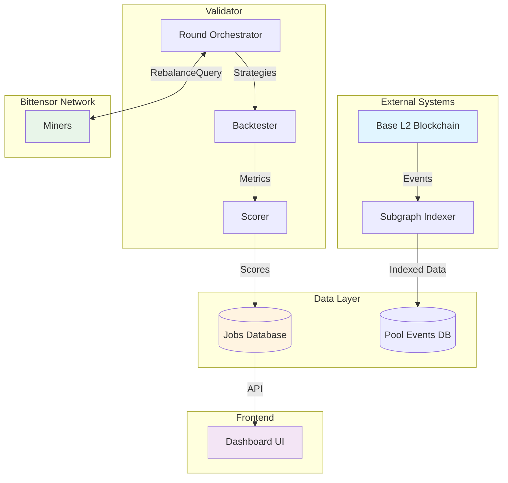

# SN98 ForeverMoney - Technical Documentation

> **Comprehensive documentation for the SN98 bittensor subnet for decentralized automated liquidity management**

Welcome to the complete technical documentation for the SN98 ForeverMoney project. This documentation suite provides in-depth information about the system architecture, data models, services, workflows, and integration guides.

---

## 📚 Documentation Index

### Core Documentation

#### [System Documentation](./SYSTEM_DOCUMENTATION.md) (75+ pages)
**Complete technical reference covering the entire system**

- **System Overview**: What is SN98, key features, network information
- **Architecture**: High-level design, components, data layers
- **Data Models**: Protocol models, validator database models, pool events models
- **Core Services**: Backtester, Scorer, Liquidity Manager services
- **Workflows & Orchestration**: Round execution, validator operations
- **Testing Systems**: Integration tests, validation workflows
- **Appendices**: Database schemas, algorithms, glossary

**Best for**: Understanding the complete system, onboarding new developers

---

#### [Implementation Plan](./IMPLEMENTATION_PLAN.md) (NEW - 10-Day Sprint)
**Complete plan for building the admin panel**

- **Tech Stack**: FastAPI backend + Next.js 14 frontend
- **Team Structure**: 1 Backend + 2 Frontend + 1 Coordinator
- **Timeline**: 10 days (accelerated sprint)
- **Backend API**: RESTful endpoints + WebSocket server
- **Frontend**: Dashboard, leaderboard, miners, executions
- **Deployment**: Vercel (frontend) + Railway (backend)

**Best for**: Project managers, team leads planning development

---

#### [Task Breakdown](./TASK_BREAKDOWN.md) (NEW - Daily Assignments)
**Day-by-day task assignments for 4-person team**

- **Daily Tasks**: Detailed breakdown for each team member
- **Time Estimates**: Hourly estimates for each task
- **Deliverables**: Clear deliverables for each day
- **Dependencies**: Critical path and integration points
- **Communication**: Standup schedule and sync points

**Best for**: Team members executing the 10-day sprint

---

#### [Variable Mapping](./VARIABLE_MAPPING.md) (50+ pages)
**Complete reference of all variables, configurations, and data fields**

- **Environment Variables**: All 18+ configuration variables with usage examples
- **Protocol Variables**: RebalanceQuery synapse fields, Position models, Inventory
- **Database Fields**: Complete field mappings for all 10 database tables
- **Service Variables**: Backtester inputs/outputs, Scorer parameters
- **Smart Contract Variables**: SNLiquidityManager, Uniswap V3 Pool methods
- **Frontend Data Points**: Dashboard metrics, leaderboard columns, charts

**Best for**: Configuration setup, debugging, data field lookups

---

#### [Data Flows](./DATA_FLOWS.md) (40+ pages)
**Visual diagrams and architecture documentation**

- **System Data Flow**: Complete end-to-end data movement
- **Evaluation Round Flow**: Sequence diagram of round execution
- **Database Relationships**: Entity-relationship diagrams
- **Backtester Pipeline**: Algorithm flow with detailed steps
- **Scorer Algorithm**: Visual representation with penalty examples
- **Live Execution Flow**: On-chain execution sequence
- **API Response Examples**: Sample JSON responses

**Best for**: Understanding how data moves through the system, visual learners

---

#### [Frontend Integration](./FRONTEND_INTEGRATION.md) (60+ pages)
**Complete guide for building a frontend dashboard**

- **API Specifications**: All REST endpoints with TypeScript types
- **WebSocket Events**: Real-time event schemas and handlers
- **Component Architecture**: Recommended component tree
- **Data Models**: TypeScript interfaces for all entities
- **Example Implementations**: React/Next.js components with TanStack Query
- **Best Practices**: Polling strategies, caching, error handling

**Best for**: Frontend developers, building the dashboard UI

---

## 🎯 Quick Navigation

### By Role

| Role | Start Here | Also Read |
|------|------------|-----------|
| **New Developer** | [System Documentation](./SYSTEM_DOCUMENTATION.md) → Architecture | [Data Flows](./DATA_FLOWS.md) |
| **Validator Operator** | [Variable Mapping](./VARIABLE_MAPPING.md) → Env Variables | [System Documentation](./SYSTEM_DOCUMENTATION.md) → Workflows |
| **Miner Developer** | [System Documentation](./SYSTEM_DOCUMENTATION.md) → Protocol Models | [MINER_GUIDE.md](../MINER_GUIDE.md) |
| **Frontend Developer** | [Frontend Integration](./FRONTEND_INTEGRATION.md) | [Data Flows](./DATA_FLOWS.md) → API Examples |
| **Data Analyst** | [Variable Mapping](./VARIABLE_MAPPING.md) → Database Fields | [Data Flows](./DATA_FLOWS.md) → Database Queries |

### By Task

| Task | Documentation | Section |
|------|--------------|---------|
| **Set up validator** | [Variable Mapping](./VARIABLE_MAPPING.md) | Environment Variables |
| **Understand scoring** | [System Documentation](./SYSTEM_DOCUMENTATION.md) | Scorer Service |
| **Build API** | [Frontend Integration](./FRONTEND_INTEGRATION.md) | API Specifications |
| **Debug round issues** | [Data Flows](./DATA_FLOWS.md) | Evaluation Round Flow |
| **Query database** | [Variable Mapping](./VARIABLE_MAPPING.md) | Database Fields |
| **Implement WebSockets** | [Frontend Integration](./FRONTEND_INTEGRATION.md) | WebSocket Events |

---

## 🏗️ System Architecture Quick Reference



---

## 📊 Key Concepts

### Dual-Mode Operation

| Mode | Purpose | Participants | Frequency |
|------|---------|--------------|-----------|
| **Evaluation** | Test all miners in simulation | All active miners | Every round (~15 min) |
| **Live** | Execute strategy on-chain | Winner from previous eval | After eligibility (7+ days) |

### Scoring Mechanism

```
combined_score = (evaluation_score × 0.6) + (live_score × 0.4)

where:
  evaluation_score = EMA with α=0.1 (slow updates)
  live_score = EMA with α=0.3 (fast updates)
```

### Database Tables

| Table | Purpose | Growth Rate | Indexes |
|-------|---------|-------------|---------|
| `jobs` | Job definitions | Slow (manual) | `job_id`, `is_active` |
| `rounds` | Round records | ~100/day/job | `(job_id, round_number)` |
| `predictions` | Miner responses | ~15k/day/job | `(round_id, miner_uid)` |
| `miner_scores` | Reputation | Slow (updates) | `(job_id, combined_score)` |

---

## 🔌 API Quick Reference

### Base URL
```
http://localhost:8000/api
```

### Key Endpoints

```typescript
GET /api/jobs                          // List all jobs
GET /api/jobs/{job_id}                 // Job details
GET /api/jobs/{job_id}/leaderboard     // Ranked miners
GET /api/jobs/{job_id}/rounds          // Round history
GET /api/jobs/{job_id}/executions      // Live executions
GET /api/miners/{uid}                  // Miner profile
GET /api/miners/{uid}/jobs/{job_id}    // Miner on job
```

### WebSocket Events

```typescript
socket.on('round_started', ...)        // New round begins
socket.on('round_completed', ...)      // Round finishes
socket.on('score_updated', ...)        // Miner score changes
socket.on('live_execution', ...)       // Strategy executed on-chain
```

---

## 🚀 Getting Started

### For Developers

1. **Read**: [System Documentation](./SYSTEM_DOCUMENTATION.md) - System Overview
2. **Setup**: Follow [LOCAL_SETUP_GUIDE.md](../LOCAL_SETUP_GUIDE.md)
3. **Configure**: See [Variable Mapping](./VARIABLE_MAPPING.md) - Environment Variables
4. **Explore**: Review [Data Flows](./DATA_FLOWS.md) for visual understanding

### For Frontend Developers

1. **Read**: [Frontend Integration](./FRONTEND_INTEGRATION.md) - Overview
2. **API**: Review API Specifications section
3. **Examples**: Check Example Implementations section
4. **Build**: Start with Dashboard component

### For Miners

1. **Read**: [../MINER_GUIDE.md](../MINER_GUIDE.md)
2. **Protocol**: See [System Documentation](./SYSTEM_DOCUMENTATION.md) - Protocol Models
3. **Test**: Follow miner testing guide
4. **Deploy**: Register and start accepting queries

---

## 📖 Additional Resources

### Project Documentation

- [README.md](../README.md) - Project overview and quick start
- [ARCHITECTURE.md](../ARCHITECTURE.md) - High-level architecture
- [MINER_GUIDE.md](../MINER_GUIDE.md) - Miner implementation guide
- [LOCAL_SETUP_GUIDE.md](../LOCAL_SETUP_GUIDE.md) - Local development setup
- [spec.md](../spec.md) - Technical specification

### Code References

- [protocol/models.py](../protocol/models.py) - Protocol data models
- [protocol/synapses.py](../protocol/synapses.py) - RebalanceQuery synapse
- [validator/models/job.py](../validator/models/job.py) - Database models
- [validator/round_orchestrator.py](../validator/round_orchestrator.py) - Round orchestration
- [validator/services/backtester.py](../validator/services/backtester.py) - Backtesting service
- [validator/services/scorer.py](../validator/services/scorer.py) - Scoring service

---

## 📝 Documentation Conventions

### File Naming

- **UPPERCASE.md**: Technical documentation files
- **PascalCase.md**: Guide files (MinerGuide.md)
- **lowercase.md**: Project meta files (spec.md)

### Internal Links

Documentation uses relative links:
```markdown
[System Documentation](./SYSTEM_DOCUMENTATION.md)
[Miner Guide](../MINER_GUIDE.md)
[Code Reference](../validator/models/job.py)
```

### Code References

File links include line numbers where relevant:
```markdown
[job.py:L37-L67](file:///path/to/validator/models/job.py#L37-L67)
```

---

## 🤝 Contributing

When updating documentation:

1. **Keep in sync**: Update related docs when making code changes
2. **Add examples**: Include code examples and diagrams
3. **Link properly**: Use relative links for portability
4. **Test links**: Verify all markdown links work
5. **Update README**: Add new docs to this index

---

## 📊 Documentation Coverage

| Area | Coverage | Documents |
|------|----------|-----------|
| **System Architecture** | ✅ Complete | [System Documentation](./SYSTEM_DOCUMENTATION.md) |
| **Data Models** | ✅ Complete | [System Documentation](./SYSTEM_DOCUMENTATION.md), [Variable Mapping](./VARIABLE_MAPPING.md) |
| **Services** | ✅ Complete | [System Documentation](./SYSTEM_DOCUMENTATION.md), [Data Flows](./DATA_FLOWS.md) |
| **API Specifications** | ✅ Complete | [Frontend Integration](./FRONTEND_INTEGRATION.md) |
| **Variables & Config** | ✅ Complete | [Variable Mapping](./VARIABLE_MAPPING.md) |
| **Data Flows** | ✅ Complete | [Data Flows](./DATA_FLOWS.md) |
| **Frontend Guide** | ✅ Complete | [Frontend Integration](./FRONTEND_INTEGRATION.md) |
| **Testing** | ✅ Complete | [System Documentation](./SYSTEM_DOCUMENTATION.md) - Testing Systems |

---

## 📄 License

This documentation is part of the SN98 ForeverMoney project and follows the same license as the main project.

---

## 💬 Support

For questions or issues:

1. **Check documentation** first (use Quick Navigation above)
2. **Review code** in linked source files
3. **Open an issue** on GitHub
4. **Join Discord** for community support

---

**Last Updated**: 2026-01-27  
**Documentation Version**: 1.0.0  
**Project**: SN98 ForeverMoney - Subnet #98
