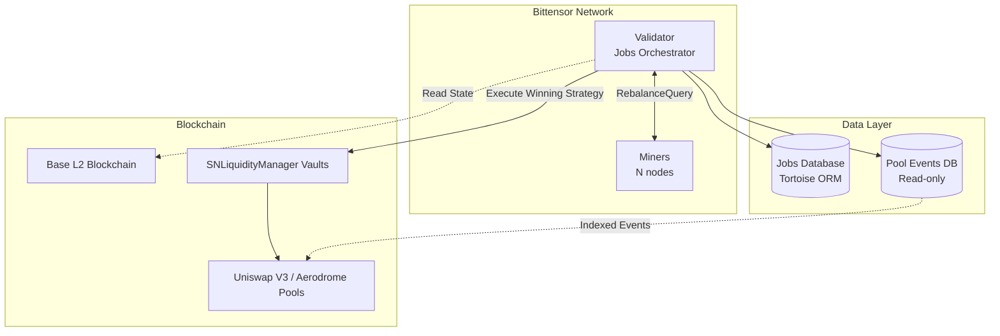
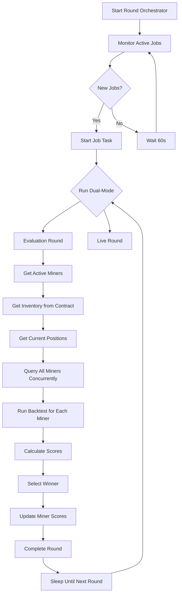
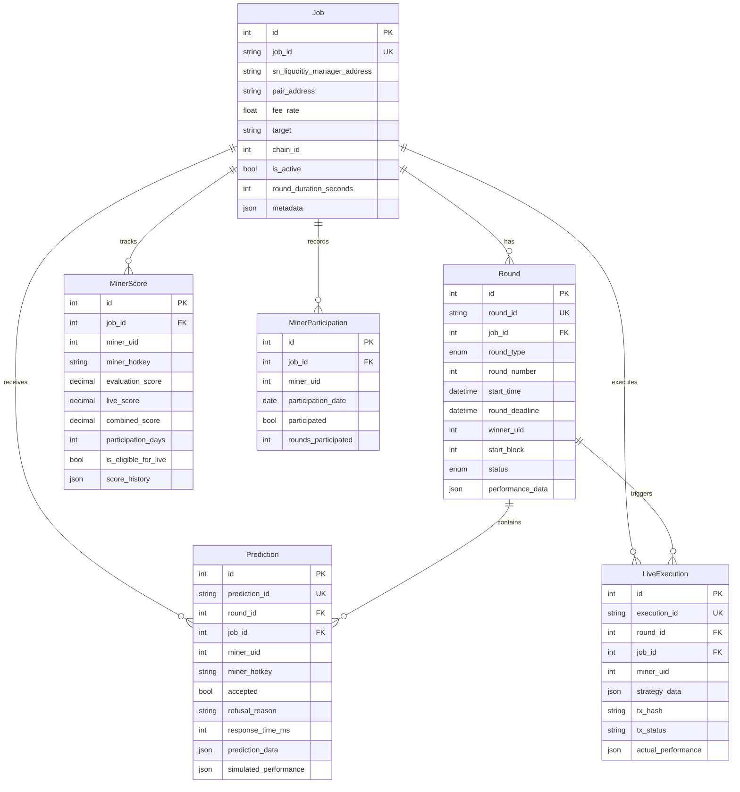

# SN98 ForeverMoney - Complete System Documentation

> **Decentralized Automated Liquidity Management on Bittensor**
> 
> A comprehensive technical reference for the SN98 subnet that optimizes Uniswap V3 / Aerodrome liquidity provision through competitive AI strategies on Base L2.

---

## Table of Contents

1. [System Overview](#system-overview)
2. [Architecture](#architecture)
3. [Data Models](#data-models)
4. [Core Services](#core-services)
5. [Workflows & Orchestration](#workflows--orchestration)
6. [Variable Reference](#variable-reference)
7. [Frontend Integration](#frontend-integration)
8. [Testing Systems](#testing-systems)

---

## System Overview

### What is SN98 ForeverMoney?

SN98 is a Bittensor subnet (Subnet #98) that creates a decentralized marketplace for automated liquidity management strategies. Miners compete by proposing optimal liquidity provision strategies for Uniswap V3/Aerodrome pools, while validators evaluate and execute the best strategies on-chain.

### Key Features

| Feature | Description |
|---------|-------------|
| **Jobs-Based Architecture** | Multiple liquidity pools managed concurrently, each as a separate "job" |
| **Dual-Mode Operation** | Evaluation rounds (all miners) + Live rounds (winning miners only) |
| **Rebalance-Only Protocol** | Miners decide when and how to adjust positions dynamically |
| **Per-Job Reputation** | Miners build scores for specific trading pairs |
| **7-Day Participation** | Consistent performance needed for live execution eligibility |
| **PoL Target Scoring** | Maximize value growth with inventory protection penalty |

### Network Information

```yaml
Subnet ID: 98
Network: Bittensor Finney (mainnet)
Protocol: Uniswap V3 / Aerodrome
Blockchain: Base L2 (Chain ID: 8453)
Round Duration: 15 minutes (configurable per job)
Live Eligibility: 7 days participation
Rebalance Interval: Every 100 blocks (configurable)
```

---

## Architecture

### High-Level System Design



### Components

#### 1. **Validator** (Jobs Orchestrator)
- Manages multiple concurrent jobs
- Runs evaluation and live rounds simultaneously
- Queries miners for rebalancing decisions
- Scores strategies using backtesting
- Executes winning strategies on-chain

#### 2. **Miners** (Strategy Providers)
- Respond to `RebalanceQuery` requests
- Propose position rebalancing decisions
- Can accept/refuse jobs
- Build reputation through performance

#### 3. **Jobs Database** (Postgres + Tortoise ORM)
- Stores validator state, rounds, scores
- Tracks miner participation and eligibility
- Records strategy predictions and execution

#### 4. **Pool Events Database** (Postgres - Read-only)
- Historical on-chain events from subgraph
- Swaps, mints, burns, fee collections
- Used for backtesting strategies

#### 5. **SNLiquidityManager** (Smart Contract)
- Manages liquidity positions on-chain
- Holds token inventory
- Executes winning strategies

---

## Data Models

### Protocol Models

Located in [`protocol/models.py`](file:///Users/soneshwar/Desktop/codes/forever-money/protocol/models.py)

#### Inventory
```python
class Inventory(BaseModel):
    amount0: str  # Amount of token0 in wei
    amount1: str  # Amount of token1 in wei
```

**Purpose**: Represents available tokens for deployment

**Usage**: 
- Passed to miners in `RebalanceQuery`
- Fetched from `SNLiquidityManager` contract
- Updated after each rebalance

---

#### Position
```python
class Position(BaseModel):
    tick_lower: int  # Lower tick bound
    tick_upper: int  # Upper tick bound
    allocation0: str  # Amount of token0 to allocate
    allocation1: str  # Amount of token1 to allocate
    confidence: Optional[float]  # Confidence score (0-1)
```

**Purpose**: Defines a single Uniswap V3 concentrated liquidity position

**Validation**: `tick_upper` must be greater than `tick_lower`

**Usage**:
- Miners return list of desired positions
- Validator simulates positions for backtesting
- Positions deployed to `SNLiquidityManager` on-chain

---

#### Strategy
```python
class Strategy(BaseModel):
    positions: List[Position]  # List of LP positions
    rebalance_rule: Optional[RebalanceRule]  # Optional rebalance trigger
```

**Purpose**: Complete strategy output from miner

---

#### PerformanceMetrics
```python
class PerformanceMetrics(BaseModel):
    net_pnl: float  # Net PnL in base currency
    hodl_pnl: float  # HODL baseline PnL
    net_pnl_vs_hodl: float  # Net PnL vs HODL
    total_fees_collected: float  # Total LP fees collected
    impermanent_loss: float  # Impermanent loss incurred
    num_rebalances: int  # Number of rebalances executed
```

**Purpose**: Metrics calculated by backtester for scoring

---

### Validator Database Models

Located in [`validator/models/job.py`](file:///Users/soneshwar/Desktop/codes/forever-money/validator/models/job.py)

#### Job
```python
class Job(Model):
    id: int  # Auto-increment PK
    job_id: str  # Unique identifier (indexed)
    sn_liquditiy_manager_address: str  # Vault managing liquidity
    pair_address: str  # Trading pair address
    fee_rate: float  # Pool fee rate (e.g., 0.03 for 3%)
    target: str  # Job target ("PoL" = Proof of Liquidity)
    target_ratio: float  # Target ratio (default: 0.5)
    chain_id: int  # EVM Chain ID (8453 for Base)
    is_active: bool  # Job enabled/disabled
    round_duration_seconds: int  # Round duration (default: 900s)
    created_at: datetime
    updated_at: datetime
    metadata: dict  # Additional JSON data
```

**Table**: `jobs`

**Purpose**: Represents a liquidity management task for a specific vault and trading pair

**Relationships**:
- One-to-many with `Round`
- One-to-many with `MinerScore`

**Key Fields**:
- `job_id`: Unique identifier (e.g., "job_eth_usdc_001")
- `sn_liquditiy_manager_address`: Smart contract managing this pool's liquidity
- `pair_address`: Uniswap V3 pool address
- `is_active`: Controls whether job is running

---

#### Round
```python
class Round(Model):
    id: int
    round_id: str  # Unique identifier (indexed)
    job: ForeignKey[Job]  # Parent job
    round_type: RoundType  # EVALUATION or LIVE
    round_number: int  # Sequential number
    start_time: datetime
    round_deadline: datetime
    end_time: Optional[datetime]
    winner_uid: Optional[int]  # Winning miner UID
    start_block: int  # Blockchain start block
    status: RoundStatus  # PENDING, ACTIVE, COMPLETED, FAILED
    performance_data: dict  # JSON with scores
    created_at: datetime
```

**Table**: `rounds`

**Unique Constraint**: `(job_id, round_number, round_type)`

**Purpose**: Represents a single evaluation or live round for a job

**Round Types**:
- **EVALUATION**: All miners compete in forward simulation
- **LIVE**: Winning miner executes strategy on-chain

**Workflow**:
1. Created at round start (`PENDING`)
2. Activated (`ACTIVE`)
3. Completed with winner selection (`COMPLETED`)
4. or `FAILED` if errors occur

---

#### Prediction
```python
class Prediction(Model):
    id: int
    prediction_id: str  # Unique identifier
    round: ForeignKey[Round]
    job: ForeignKey[Job]
    miner_uid: int  # Bittensor miner UID
    miner_hotkey: str  # Miner's hotkey (66 chars)
    accepted: bool  # Whether miner accepted job
    refusal_reason: Optional[str]  # Reason if refused
    response_time_ms: Optional[int]  # Response time
    prediction_data: dict  # Rebalancing decisions (JSON)
    submitted_at: datetime
    simulated_performance: dict  # Performance metrics
```

**Table**: `predictions`

**Unique Constraint**: `(round_id, miner_uid)`

**Purpose**: Stores miner's response and rebalancing decisions for a round

**Key Fields**:
- `accepted`: `False` if miner refused job
- `prediction_data`: List of rebalance history with positions
- `simulated_performance`: Backtester output metrics

---

#### MinerScore
```python
class MinerScore(Model):
    id: int
    job: ForeignKey[Job]
    miner_uid: int
    miner_hotkey: str
    
    # Score components (Decimal for precision)
    evaluation_score: Decimal  # EMA from evaluation rounds
    live_score: Decimal  # EMA from live rounds
    combined_score: Decimal  # Weighted combination
    
    # Activity tracking
    total_evaluations: int
    total_live_rounds: int
    successful_evaluations: int
    successful_live_rounds: int
    refusals: int
    
    # Participation tracking
    first_seen: datetime
    last_active: datetime
    participation_days: int
    is_eligible_for_live: bool  # 7+ days participation
    
    # Historical data
    score_history: dict  # JSON with historical scores
    updated_at: datetime
```

**Table**: `miner_scores`

**Unique Constraint**: `(job_id, miner_uid)`

**Indexes**:
- `(job_id, combined_score)` - for leaderboards
- `(job_id, is_eligible_for_live, combined_score)` - for live selection

**Purpose**: Per-job reputation tracking using exponential moving averages

**Score Calculation**:
```python
# Evaluation EMA: α = 0.1
evaluation_score_new = evaluation_score_old * 0.9 + round_score * 0.1

# Live EMA: α = 0.3
live_score_new = live_score_old * 0.7 + round_score * 0.3

# Combined Score
combined_score = evaluation_score * 0.6 + live_score * 0.4
```

**Eligibility**:
- `is_eligible_for_live = True` requires 7+ days of participation
- Calculated from `MinerParticipation` records

---

#### MinerParticipation
```python
class MinerParticipation(Model):
    id: int
    job: ForeignKey[Job]
    miner_uid: int
    participation_date: date  # Daily tracking
    participated: bool
    rounds_participated: int
    rounds_refused: int
    created_at: datetime
```

**Table**: `miner_participation`

**Unique Constraint**: `(job_id, miner_uid, participation_date)`

**Purpose**: Daily participation tracking for eligibility calculation

**Usage**: Count distinct days in last 7 days to determine live eligibility

---

#### LiveExecution
```python
class LiveExecution(Model):
    id: int
    execution_id: str  # Unique identifier
    round: ForeignKey[Round]
    job: ForeignKey[Job]
    miner_uid: int
    sn_liquditiy_manager_address: str
    
    # Execution details
    strategy_data: dict  # Winning strategy JSON
    tx_hash: Optional[str]  # Transaction hash
    tx_status: Optional[str]  # pending, success, failed
    
    # Performance tracking
    actual_performance: dict  # Real on-chain performance
    
    executed_at: datetime
    updated_at: datetime
```

**Table**: `live_executions`

**Purpose**: Records on-chain execution of winning strategies

---

### Pool Events Models

Located in [`validator/models/pool_events.py`](file:///Users/soneshwar/Desktop/codes/forever-money/validator/models/pool_events.py)

These models represent **read-only** tables populated by a subgraph indexer.

#### SwapEvent
```python
class SwapEvent(Model):
    id: int
    evt_address: str  # Pool address (without 0x)
    evt_block_number: int
    evt_tx_hash: str
    evt_block_time: int  # Unix timestamp
    
    # Swap details
    sqrt_price_x96: Decimal  # Price after swap (Q96)
    tick: int  # Tick after swap
    amount0: Decimal  # Token0 delta (signed)
    amount1: Decimal  # Token1 delta (signed)
    liquidity: Decimal  # Active liquidity
    sender: str
    recipient: str
```

**Table**: `swaps`

**Purpose**: Historical swap events for backtesting price movement

**Indexes**: `(evt_address, evt_block_number)`

---

#### MintEvent, BurnEvent, CollectEvent

Similar structure tracking liquidity additions, removals, and fee collections.

**Purpose**: Calculate fees earned, liquidity changes over time

---

## Core Services

### Backtester Service

Located in [`validator/services/backtester.py`](file:///Users/soneshwar/Desktop/codes/forever-money/validator/services/backtester.py)

**Purpose**: Simulates LP strategy performance using historical pool events

```python
class BacktesterService:
    def __init__(self, data_source: DataSource):
        self.db = data_source  # PoolDataDB instance
```

#### Key Method: `evaluate_positions_performance`

```python
async def evaluate_positions_performance(
    pair_address: str,
    rebalance_history: List[Dict[str, Any]],
    start_block: int,
    end_block: int,
    initial_inventory: Inventory,
    fee_rate: float,
) -> Dict[str, Any]
```

**Parameters**:
- `pair_address`: Pool address to backtest
- `rebalance_history`: List of rebalancing decisions with blocks and positions
- `start_block`: Starting block number
- `end_block`: Ending block number
- `initial_inventory`: Initial token amounts
- `fee_rate`: Pool fee rate (e.g., 0.03 for 3%)

**Returns**:
```python
{
    "fees_collected": int,  # Total fees in token1 units
    "impermanent_loss": float,  # IL as fraction (0.0 to 1.0)
    "fees0": float,  # Fees in token0
    "fees1": float,  # Fees in token1
    "in_range_ratio": float,  # Fraction of time in range
    "amount0_deployed": int,  # Token0 in positions
    "amount1_deployed": int,  # Token1 in positions
    "amount0_holdings": int,  # Total token0 (deployed + idle)
    "amount1_holdings": int,  # Total token1 (deployed + idle)
    "final_sqrt_price_x96": int,  # Final price
}
```

**Algorithm**:
1. Retrieve all swap events in block range
2. For each swap event:
   a. Get deployed positions at that block from rebalance history
   b. Calculate in-range liquidity for each position
   c. Determine liquidity share: `position_liquidity / (pool_liquidity + position_liquidity)`
   d. Calculate fees earned based on share and swap volume
3. Calculate final amounts and impermanent loss
4. Return comprehensive performance metrics

**Key Innovation**: Accurate liquidity share calculation using actual pool liquidity from events

---

### Scorer Service

Located in [`validator/services/scorer.py`](file:///Users/soneshwar/Desktop/codes/forever-money/validator/services/scorer.py)

**Purpose**: Score strategies based on PoL (Proof of Liquidity) target

```python
class Scorer:
    @staticmethod
    async def score_pol_strategy(
        performance_metrics: Dict[str, Any],
        initial_inventory: Dict[str, Any],
        loss_penalty_multiplier: float = 10.0,
        smooth_beta: float = 4.0,
    ) -> float
```

**Parameters**:
- `performance_metrics`: Output from backtester
- `initial_inventory`: Initial token amounts and price
- `loss_penalty_multiplier`: Penalty strength (default: 10.0)
- `smooth_beta`: Controls loss aggregation (default: 4.0)

**Scoring Formula**:

```python
# 1. Calculate value gain (token1 units)
initial_value = initial_amount0 * initial_price + initial_amount1
final_value = (final_amount0 + fees0) * final_price + (final_amount1 + fees1)
value_gain = final_value - initial_value

# 2. Calculate inventory loss ratios
loss_ratio0 = max(0, initial_amount0 - final_amount0) / initial_amount0
loss_ratio1 = max(0, initial_amount1 - final_amount1) / initial_amount1

# 3. Smooth-max aggregation (log-sum-exp)
m = max(loss_ratio0, loss_ratio1)
inventory_loss_ratio = m + (1/smooth_beta) * log(
    exp(smooth_beta * (loss_ratio0 - m)) + 
    exp(smooth_beta * (loss_ratio1 - m))
)

# 4. Exponential penalty
penalty_factor = exp(-loss_penalty_multiplier * inventory_loss_ratio)

# 5. Apply penalty symmetrically
if value_gain >= 0:
    score = value_gain * penalty_factor
else:
    score = value_gain / penalty_factor
```

**Penalty Examples**:
- 10% inventory loss → 63% score reduction
- 50% inventory loss → 99% score reduction

**Design Principles**:
- Primary signal: value growth from price appreciation and fees
- Secondary signal: inventory protection
- Always produces total ordering (rankable)

---

### Liquidity Manager Service

Located in [`validator/services/liqmanager.py`](file:///Users/soneshwar/Desktop/codes/forever-money/validator/services/liqmanager.py)

**Purpose**: Interface with `SNLiquidityManager` smart contract

```python
class SnLiqManagerService:
    def __init__(
        chain_id: int,
        liquidity_manager_address: str,
        pool_address: str,
    )
```

#### Key Methods

**1. Get Inventory**
```python
async def get_inventory() -> Inventory
```

**Algorithm**:
1. Extract token0 and token1 from pool contract
2. Check which token is registered as AK (Autonomous Keeper)
3. Query `akToStashedTokens` for both tokens
4. Return `Inventory(amount0, amount1)`

**2. Get Current Price**
```python
async def get_current_price() -> int # sqrtPriceX96
```

Fetches `slot0` from pool contract

**3. Get Current Positions**
```python
async def get_current_positions() -> List[Position]
```

**Algorithm**:
1. Determine AK token (token0 or token1)
2. Get `PositionManager` address for AK token
3. Retrieve NFT token IDs from PositionManager
4. For each NFT, query `NonfungiblePositionManager.positions(tokenId)`
5. Extract `tick_lower`, `tick_upper`, `liquidity`
6. Convert to `Position` objects

---

## Workflows & Orchestration

### Round Orchestrator Flow

Located in [`validator/round_orchestrator.py`](file:///Users/soneshwar/Desktop/codes/forever-money/validator/round_orchestrator.py)



### Evaluation Round Flow

**Purpose**: Test all miner strategies in forward simulation from current blockchain state

**Steps**:

1. **Initialization**
   ```python
   round_number += 1
   current_block = await get_latest_block()
   inventory = await liq_manager.get_inventory()
   initial_positions = await liq_manager.get_current_positions()
   ```

2. **Create Round Record**
   ```python
   round_obj = await job_repository.create_round(
       job=job,
       round_type=RoundType.EVALUATION,
       round_number=round_number,
       start_block=current_block,
   )
   ```

3. **Query Miners Concurrently**
   ```python
   tasks = []
   for uid in active_uids:
       task = _run_with_miner_for_evaluation(
           miner_uid=uid,
           job=job,
           round_=round_obj,
           initial_positions=initial_positions,
           start_block=current_block,
           initial_inventory=inventory,
       )
       tasks.append(task)
   
   results = await asyncio.gather(*tasks)
   ```

4. **Run Backtest for Each Miner**
   
   For each miner, the validator:
   
   a. **Simulate block-by-block** until round deadline
   
   b. **At rebalance checkpoints** (every N blocks):
      ```python
      if (current_block - start_block) % rebalance_check_interval == 0:
          response = await query_miner_for_rebalance(
              miner_uid=uid,
              current_price=price,
              current_positions=current_positions,
              inventory=current_inventory,
          )
      ```
   
   c. **Process miner response**:
      - If `accepted = False`: Skip miner
      - If `desired_positions = current_positions`: No rebalance
      - Otherwise: Update positions and inventory
   
   d. **Track rebalance history**:
      ```python
      rebalance_history.append({
          "block": current_block,
          "price": price,
          "old_positions": current_positions,
          "new_positions": desired_positions,
          "inventory": updated_inventory,
      })
      ```

5. **Calculate Performance**
   ```python
   performance_metrics = await backtester.evaluate_positions_performance(
       pair_address=job.pair_address,
       rebalance_history=rebalance_history,
       start_block=start_block,
       end_block=current_block,
       initial_inventory=inventory,
       fee_rate=job.fee_rate,
   )
   ```

6. **Score Strategy**
   ```python
   round_score = await Scorer.score_pol_strategy(
       performance_metrics,
       initial_inventory_dict,
   )
   ```

7. **Update Miner Score (EMA)**
   ```python
   await job_repository.update_miner_score(
       job_id=job.job_id,
       miner_uid=miner_uid,
       evaluation_score=round_score,
       round_type=RoundType.EVALUATION,
   )
   ```

8. **Select Winner**
   ```python
   winner = max(scores.items(), key=lambda x: x[1]['score'])
   ```

9. **Complete Round**
   ```python
   await job_repository.complete_round(
       round_id=round_obj.round_id,
       winner_uid=winner['miner_uid'],
       performance_data={'scores': scores},
   )
   ```

### Live Round Flow

**Purpose**: Execute winning miner's strategy on-chain

**Steps**:
1. Get previous evaluation winner
2. Check eligibility (7+ days participation)
3. If eligible, query winner for live rebalancing
4. Send rebalance decisions to executor bot
5. Track actual on-chain performance
6. Update live scores (EMA: 0.7×old + 0.3×new)

---

## Variable Reference

### Environment Variables

Located in [`validator/utils/env.py`](file:///Users/soneshwar/Desktop/codes/forever-money/validator/utils/env.py)

#### Network Configuration

| Variable | Type | Default | Description |
|----------|------|---------|-------------|
| `NETUID` | int | 98 | Bittensor subnet ID |
| `SUBTENSOR_NETWORK` | str | "finney" | Subtensor network endpoint |
| `MAINNET_RPC` | str | https://eth.llamarpc.com | Ethereum mainnet RPC |
| `BASE_RPC` | str | https://base.llamarpc.com | Base L2 RPC |

#### Validator Configuration

| Variable | Type | Default | Description |
|----------|------|---------|-------------|
| `EXECUTOR_BOT_URL` | str | None | Executor bot API endpoint |
| `EXECUTOR_BOT_API_KEY` | str | None | API key for executor bot |
| `REBALANCE_CHECK_INTERVAL` | int | 100 | Blocks between rebalance checks |

#### Database Configuration

| Variable | Type | Default | Description |
|----------|------|---------|-------------|
| `JOBS_POSTGRES_HOST` | str | "localhost" | Jobs database host |
| `JOBS_POSTGRES_PORT` | int | 5432 | Jobs database port |
| `JOBS_POSTGRES_DB` | str | "sn98_jobs" | Jobs database name |
| `JOBS_POSTGRES_USER` | str | "sn98_user" | Jobs database username |
| `JOBS_POSTGRES_PASSWORD` | str | "" | Jobs database password |
| `POOL_EVENTS_POSTGRES_*` | str | - | Pool events DB (separate) |

#### Miner Configuration

| Variable | Type | Default | Description |
|----------|------|---------|-------------|
| `MINER_VERSION` | str | "0.1.0" | Miner version string |

### Configuration Objects

#### JobRepository Config

No additional config - uses Tortoise ORM with DB URL

#### RoundOrchestrator Config

```python
config = {
    "netuid": int,
    "subtensor_network": str,
    "executor_bot_url": str,
    "executor_bot_api_key": str,
    "rebalance_check_interval": int,
    "tortoise_db_url": str,  # Built from JOBS_POSTGRES_*
}
```

---

## Frontend Integration

### Data Endpoints to Implement

The frontend will need to query the following data from the Jobs database:

#### 1. Jobs List
```python
# Query
await Job.filter(is_active=True).all()

# Response Schema
{
    "jobs": [
        {
            "job_id": str,
            "sn_liquditiy_manager_address": str,
            "pair_address": str,
            "fee_rate": float,
            "target": str,
            "chain_id": int,
            "is_active": bool,
            "round_duration_seconds": int,
            "created_at": datetime,
        }
    ]
}
```

#### 2. Job Details
```python
# Query
job = await Job.get(job_id="job_eth_usdc_001")

# Include related data
rounds = await Round.filter(job=job).order_by('-round_number').limit(10)
top_miners = await MinerScore.filter(job=job).order_by('-combined_score').limit(10)
```

#### 3. Leaderboard (Per Job)
```python
# Query
leaderboard = await MinerScore.filter(
    job_id=job_id
).order_by('-combined_score').limit(100)

# Response Schema
{
    "leaderboard": [
        {
            "rank": int,
            "miner_uid": int,
            "miner_hotkey": str,
            "combined_score": float,
            "evaluation_score": float,
            "live_score": float,
            "participation_days": int,
            "is_eligible_for_live": bool,
            "total_evaluations": int,
            "total_live_rounds": int,
        }
    ]
}
```

#### 4. Round History
```python
# Query
rounds = await Round.filter(
    job_id=job_id,
    status=RoundStatus.COMPLETED
).order_by('-round_number').limit(50)

# Include winner info
for round in rounds:
    if round.winner_uid:
        winner = await MinerScore.get(
            job_id=job_id,
            miner_uid=round.winner_uid
        )
```

#### 5. Miner Performance Details
```python
# Query
miner_score = await MinerScore.get(job_id=job_id, miner_uid=uid)
predictions = await Prediction.filter(
    job_id=job_id,
    miner_uid=uid,
    accepted=True
).order_by('-submitted_at').limit(20)

# Response includes
{
    "miner": {
        "miner_uid": int,
        "scores": {...},
        "participation": {...},
        "activity": {...},
    },
    "recent_predictions": [
        {
            "round_id": str,
            "round_type": str,
            "response_time_ms": int,
            "prediction_data": dict,  # Rebalance history
            "simulated_performance": dict,  # Metrics
        }
    ]
}
```

#### 6. Live Executions
```python
# Query
executions = await LiveExecution.filter(
    job_id=job_id
).order_by('-executed_at').limit(50)

# Response Schema
{
    "executions": [
        {
            "execution_id": str,
            "round_id": str,
            "miner_uid": int,
            "strategy_data": dict,
            "tx_hash": str,
            "tx_status": str,
            "actual_performance": dict,
            "executed_at": datetime,
        }
    ]
}
```

### Real-Time Data Requirements

#### WebSocket Events

**1. Round Started**
```json
{
    "event": "round_started",
    "job_id": "job_eth_usdc_001",
    "round_id": "job_eth_usdc_001_evaluation_123_1234567890",
    "round_type": "evaluation",
    "round_number": 123,
    "start_block": 12345678
}
```

**2. Round Completed**
```json
{
    "event": "round_completed",
    "job_id": "job_eth_usdc_001",
    "round_id": "...",
    "winner_uid": 42,
    "winner_score": 1234.56,
    "total_participants": 50
}
```

**3. Score Updated**
```json
{
    "event": "score_updated",
    "job_id": "job_eth_usdc_001",
    "miner_uid": 42,
    "new_combined_score": 9876.54,
    "new_rank": 3
}
```

**4. Live Execution**
```json
{
    "event": "live_execution",
    "job_id": "job_eth_usdc_001",
    "miner_uid": 42,
    "tx_hash": "0x...",
    "strategy_summary": {...}
}
```

### API Design Recommendations

#### REST API Structure
```
GET /api/jobs                          # List all jobs
GET /api/jobs/{job_id}                 # Job details
GET /api/jobs/{job_id}/leaderboard     # Leaderboard for job
GET /api/jobs/{job_id}/rounds          # Round history
GET /api/jobs/{job_id}/executions      # Live executions
GET /api/miners/{uid}                  # Miner details (all jobs)
GET /api/miners/{uid}/jobs/{job_id}    # Miner performance on job
```

#### GraphQL Schema (Alternative)
```graphql
type Job {
  jobId: ID!
  pairAddress: String!
  isActive: Boolean!
  rounds(limit: Int): [Round!]!
  leaderboard(limit: Int): [MinerScore!]!
  liveExecutions(limit: Int): [LiveExecution!]!
}

type Round {
  roundId: ID!
  roundType: RoundType!
  roundNumber: Int!
  winner: MinerScore
  predictions: [Prediction!]!
  performanceData: JSON
}

type MinerScore {
  minerUid: Int!
  minerHotkey: String!
  combinedScore: Float!
  evaluationScore: Float!
  liveScore: Float!
  participationDays: Int!
  isEligibleForLive: Boolean!
  predictions(limit: Int): [Prediction!]!
}

type Query {
  jobs(isActive: Boolean): [Job!]!
  job(jobId: ID!): Job
  miner(uid: Int!): Miner
  leaderboard(jobId: ID!, limit: Int): [MinerScore!]!
}

type Subscription {
  roundUpdates(jobId: ID!): RoundUpdate!
  scoreUpdates(jobId: ID!): ScoreUpdate!
}
```

### Visualization Requirements

#### 1. Job Dashboard
- Active jobs grid with key metrics
- Real-time status indicators
- Pool performance charts (TVL, volume, fees)

#### 2. Leaderboard Table
- Sortable columns (score, participation, etc.)
- Pagination
- Search/filter by miner hotkey
- Visual indicators for live eligibility

#### 3. Round Timeline
- Historical round results
- Winner highlighting
- Participation stats
- Performance trends

#### 4. Miner Profile
- Score history chart (evaluation vs live)
- Participation calendar
- Recent predictions/rebalances
- Win rate statistics

#### 5. Live Execution Monitor
- Real-time execution feed
- Transaction status
- Strategy visualization (tick ranges)
- Performance comparison (predicted vs actual)

---

## Testing Systems

### Test Structure

Located in [`tests/`](file:///Users/soneshwar/Desktop/codes/forever-money/tests/) and [`scripts/`](file:///Users/soneshwar/Desktop/codes/forever-money/scripts/)

#### Integration Tests

**File**: [`scripts/test_integration.py`](file:///Users/soneshwar/Desktop/codes/forever-money/scripts/test_integration.py)

**Purpose**: End-to-end testing of validator-miner interaction

**Components Tested**:
- Database initialization
- Job creation
- Round orchestration
- Miner querying
- Backtesting
- Scoring

#### Miner Testing

**File**: [`scripts/test_miner.py`](file:///Users/soneshwar/Desktop/codes/forever-money/scripts/test_miner.py)

**Purpose**: Test miner implementation

**Components Tested**:
- Axon server startup
- RebalanceQuery handling
- Position generation
- Response formatting

### Validation Workflows

#### 1. Backtester Validation

**Test**: Compare backtester output with known historical data

```python
# Test case: ETH/USDC pool from block X to Y
# Known: Price moved from $2000 to $2100
# Known: Total fees collected = $1000

result = await backtester.evaluate_positions_performance(
    pair_address="0x...",
    positions=[...],
    start_block=X,
    end_block=Y,
    initial_inventory=Inventory(...),
    fee_rate=0.003,
)

assert abs(result['fees_collected'] - expected_fees) < tolerance
```

#### 2. Scorer Validation

**Test**: Verify penalty calculations

```python
# Test case: 10% inventory loss
initial_inventory = {"initial_amount0": 1000, "initial_amount1": 1000, ...}
performance_metrics = {
    "amount0_holdings": 900,  # 10% loss
    "amount1_holdings": 1000,
    "fees0": 0,
    "fees1": 0,
    ...
}

score = await Scorer.score_pol_strategy(performance_metrics, initial_inventory)

# Expect ~63% penalty (exp(-10 * 0.1) ≈ 0.368)
expected_penalty = 0.368
assert abs(score / value_gain - expected_penalty) < 0.01
```

#### 3. Round Flow Validation

**Test**: Complete round execution

```python
# 1. Create test job
job = await Job.create(...)

# 2. Run evaluation round
await orchestrator.run_evaluation_round(job)

# 3. Verify round completed
round_obj = await Round.filter(job=job).order_by('-round_number').first()
assert round_obj.status == RoundStatus.COMPLETED
assert round_obj.winner_uid is not None

# 4. Verify scores updated
scores = await MinerScore.filter(job=job).all()
assert len(scores) > 0
assert all(s.total_evaluations > 0 for s in scores)
```

### Manual Testing Procedures

#### 1. Validator Startup Test

**Steps**:
1. Set environment variables in `.env`
2. Initialize database: `python scripts/init_db.py`
3. Create test job: `python scripts/create_job.py`
4. Start validator: `python -m validator.validator --wallet.name test --wallet.hotkey test`
5. **Expected**: Validator starts, discovers job, begins running rounds

**Validation**:
```sql
-- Check rounds are being created
SELECT * FROM rounds ORDER BY created_at DESC LIMIT 10;

-- Check predictions are being saved
SELECT * FROM predictions ORDER BY submitted_at DESC LIMIT 10;
```

#### 2. Miner Integration Test

**Steps**:
1. Implement miner rebalance handler
2. Start miner: `python -m miner.miner --wallet.name test --wallet.hotkey test`
3. Wait for validator query
4. **Expected**: Miner receives `RebalanceQuery`, responds with positions

**Validation**:
```python
# Check miner logs for query receipt
# Check validator logs for response processing
# Check database for prediction record
```

---

## Appendix

### Database Schema Diagram



### Key Algorithms

#### Uniswap V3 Math

Located in [`validator/utils/math.py`](file:///Users/soneshwar/Desktop/codes/forever-money/validator/utils/math.py)

**Constants**:
- `Q96 = 2^96` - Fixed point precision
- `Q192 = Q96^2` - Price precision

**Key Functions**:

1. **sqrtPriceX96 to Price**
```python
price = (sqrtPriceX96 / Q96) ** 2
```

2. **Tick to sqrtPriceX96**
```python
sqrtPriceX96 = get_sqrt_ratio_at_tick(tick)
```

3. **Liquidity from Amounts**
```python
L = get_liquidity_for_amounts(
    sqrtP,      # Current price
    sqrtPA,     # Lower bound price
    sqrtPB,     # Upper bound price
    amount0,    # Token0 amount
    amount1,    # Token1 amount
)
```

4. **Amounts from Liquidity**
```python
amount0, amount1 = get_amounts_for_liquidity(
    sqrtP,   # Current price
    sqrtPA,  # Lower bound price
    sqrtPB,  # Upper bound price
    L,       # Liquidity
)
```

---

### Glossary

| Term | Definition |
|------|------------|
| **AK (Autonomous Keeper)** | Token registered in SNLiquidityManager as the "active" token |
| **PoL (Proof of Liquidity)** | Scoring target focused on value growth with inventory protection |
| **Rebalance** | Adjusting LP positions (tick ranges and allocations) |
| **sqrtPriceX96** | Uniswap V3 price representation: √(token1/token0) * 2^96 |
| **Tick** | Discrete price point in Uniswap V3 (price = 1.0001^tick) |
| **IL (Impermanent Loss)** | Loss compared to holding tokens vs providing liquidity |
| **EMA (Exponential Moving Average)** | Weighted average giving more weight to recent values |
| **Inventory** | Available tokens not currently in LP positions |
| **Position** | A specific tick range with allocated liquidity |

---

## Summary

This documentation provides a complete technical reference for the SN98 ForeverMoney bittensor subnet. Key takeaways:

1. **Architecture**: Jobs-based system with dual-mode operation (evaluation + live)
2. **Data Flow**: Validator → Miners → Backtester → Scorer → Database
3. **Scoring**: PoL target maximizes value growth with inventory protection penalty
4. **Frontend**: Needs REST/GraphQL API + WebSocket for real-time updates
5. **Testing**: Integration tests, backtester validation, round flow verification

For deployment and operational guides, see:
- [ARCHITECTURE.md](file:///Users/soneshwar/Desktop/codes/forever-money/ARCHITECTURE.md)
- [MINER_GUIDE.md](file:///Users/soneshwar/Desktop/codes/forever-money/MINER_GUIDE.md)
- [LOCAL_SETUP_GUIDE.md](file:///Users/soneshwar/Desktop/codes/forever-money/LOCAL_SETUP_GUIDE.md)
